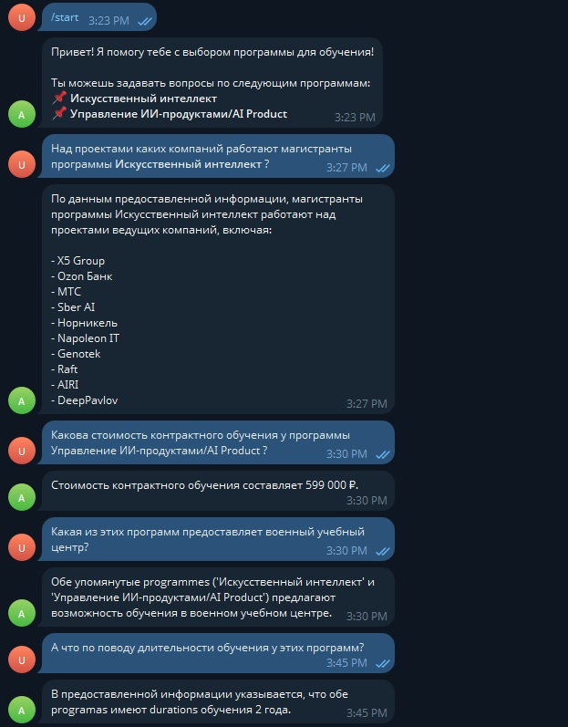

# AbitAssistant

## О проекте
Чат-бот, созданный для помощи абитуриентам в выборе между двумя магистерскими программами. 

В диалоговом режиме бот анализирует и отвечает на вопросы пользователей о программах обучения.

## Технологический стек

- aiogram - простой и легкий фреймворк для создания Telegram-ботов на Python с использованием асинхронного программирования

- ollama - локальный сервер для запуска и взаимодействия с языковыми моделями (например, LLaMA, Mistral и другими) через API

- requests + BeautifulSoup (bs4) - библиотеки для работы с HTTP-запросами и парсинга HTML-страниц

## Пример работы

